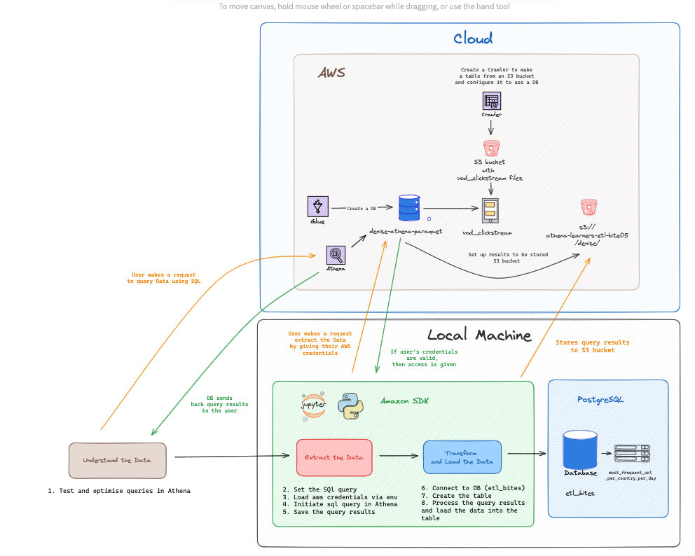

<h1 align="center">
    ETL process for Netflix Data 🎬
</h1>

This project uses the Extract, Transform, Load (ETL) process with Netflix data hosted on AWS in the Cloud. Through the ETL process, the goal is to make the data more accessible and useful, ready to be used by a wider audience, both technical and non-technical. It was completed as part of the Makers Academy Bootcamp during Week 4 of the Data Engineering stream. 

## 🏡 The scenario

I was tasked with find the most visited URL per country per day during a week of your choice (e.g. 2018-04-01 until 2018-04-08).

## 📊 Expected output

### Requirements
* A detailed diagram of the entire system. This should show how the cloud (AWS) and your local machine (Python, Jupyter Notebook, Postgres) communicate and connect to each other.

### Optional
* Code snippets.
* Screenshots of outputs from AWS or your local machine.

## 🚀 Tech Stack 

  

 ## 👷‍♀️ Infrastructure

 ### Cloud
 * A Database hosted in the Cloud using AWS Glue.
 * A folder to store query results in an S3 bucket.
 * An S3 bucket containing the Netflix dataset.
 * A crawler via AWS Glue to set up the table, linked to the S3 bucket containing the Netflix dataset.

### Local Machine
* A Jupyter Notebook using AWS SDK to connect to the database in the Cloud using valid AWS credentials,
* A local PostgreSQL database with a table ready to load the data.

 ## 🖼️ Diagram

 The following is a diagram I created using [Excalidraw](https://excalidraw.com/) to demonstrate the infrastructure I created on the Cloud and the set up I had on my Local Machine that allowed me to Extract, Transform and Load Data from the Cloud to my machine. 

 

## 🔄 ETL Process

You can find the code and full ETL process in my [Jupyter Notebook](./etl_cloud_db_challenge.ipynb).

### 1. Understand the Data 📖 
While attempting to complete this challenge, I made a plan on how to use Athena to understand the data before doing extraction, transformation, loading (ETL). You can find my plan in the following:
1. **Decipher the data** i.e. what the column names mean, what kind of values and data types.
2. **Choose which columns would be useful** - i.e. `country_code`, `url_visited`, `date`.
3. **Test queries out step by step** with the following to try out:
    * `COUNT(date)` to count how many url per country per day.
    * Filter the dates: `BETWEEN 2018-04-01 AND 2018-04-08`.
    * Use `GROUP BY on country_code, date`.
    * Do some research to find out how we could get the url that is most visited on the url column.
4. **Repeat testing until the query performs as expected**, giving the output I am looking for.

> This plan significantly helped me in thoroughly testing, refining, and optimizing the SQL query to be used for extracting the Netflix data in the Jupyer notebook. In the notebook, you can find my step by step process to modifying the SQL query and examining the results obtained from Athena.

### 2. Extract the Data 🛠️

Once I have identified the necessary SQL query for data extraction, the following was my step by step approach to extract the data:

1. **Set Up SQL Query**
    * Create a variable `sql_query` to store the SQL query to extract the Netflix data.
2. **Configure AWS SDK**
    * Set up AWS SDK in my Jupyter Notebook using Python and the Boto3 library.
3. **Configure AWS Credentials**
    * Use my AWS credentials to validate that I can access the database and S3 bucket.
4. **Create Athena Client**
    * Use Boto3 to create an Athena Client, enabling interaction with the Database and S3 bucket folder.
5. **Execute the SQL Query**
    * Initiate the SQL query through the Athena Client.
6. **Store Query Results**
    * Store the results of the SQL query into a variable `results`, to be used for data transformation and loading.

> Through using AWS SDK to connect and interact with the database in cloud, it allowed me to easily initiate and execute queries and store results without going to the console. 

> Also, it's reassuring to know that AWS ensures secure access to the database by requiring the correct credentials. This helps to protect the database from unauthorized access through the implementation of Identity Access Management, in case malicious actors attempt to perform harmful actions i.e. modifying or deleting data from the database.

### 3. Transform and Load the Data 💫

After the data has been extracted successfully and saved, I did the following to transform and load the data:

1. **Establish a Table to Store the Data**
    * Create a table in my local PostgreSQL database to store the data before transforming and loading the data.

2. **Ensure Data Integrity**
    * Iterate through each row of the extracted data to ensure none of the columns contained empty values before inserting the data into the PostgreSQL table.

> By ensuring that each row has values before loading it into my local PostgreSQL table, I eliminate unnecessary data. This helps optimize storage and reduces the time required for the transformation and loading process.

### 4. Confirm Data has Loaded ✅

1. **Establish connection with PostgreSQL database**
* Use the sql magic in Jupyer Notebook to verify successful data loading into the table.

<!-- ## ✅ Benefits of ETL
*  -->

<!-- ## 💻 Running the notebook -->